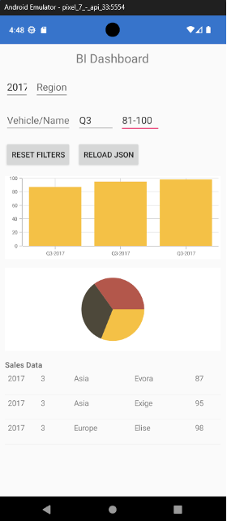
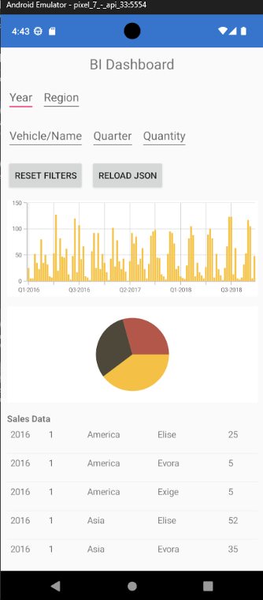

# BIDashboard

A cross-platform Business Intelligence dashboard built with Xamarin.Forms and C#, giving users a consolidated view of vehicle sales data with interactive charts, filters, and trend analysis.

 

## Overview

BIDashboard reads sales data from an embedded Excel spreadsheet and caches it locally as JSON, so data remains available even after the app is closed. Users can analyse trends, compare results by geographical region, and drill into a specific vehicle's sales activity through interactive charts and filters, all backed by asynchronous data loading so the UI never freezes, regardless of dataset size.

## Features

- Quarterly sales bar chart and vehicle distribution pie chart
- Detailed sales ListView with granular filtering
- Filter by Year, Region, Vehicle/Name, Quarter, and Quantity range
- Reset Filters and Reload JSON controls for quick data refresh
- Asynchronous data loading (`LoadDataAsync`, `FetchSalesAsync`) via background threads, keeping the UI responsive during load
- JSON caching on first launch, falling back to reading the embedded Excel file only when no cache exists
- Data bound via `ObservableCollection`, so charts and lists update automatically on filtering, aggregation, or reload with no manual refresh

## Sample Data

The dashboard is populated using [SGetSales CW2.xlsx](SGetSales-CW2.xlsx), an example sales dataset covering vehicle sales by year, quarter, region, and quantity.

## Tech Stack

C#, Xamarin.Forms (Android & iOS), Excel/JSON data handling

## My Role

Designed and built the full application solo, including data loading architecture, async/concurrency handling, data models, filtering logic, and chart/list UI.

## How to Run
**Note:** Xamarin reached end-of-life in May 2024 and was succeeded by .NET MAUI, so this project is no longer runnable on current tooling out of the box. To run it, you'll need Visual Studio with an older Xamarin/mobile workload installed (pre-2024), plus the Xamarin Android SDK / Xamarin.iOS components matching that version.

I deliberately built this on Xamarin.Forms rather than MAUI as a way to challenge myself with a framework that was already less actively supported and documented at the time, working through its quirks and constraints without the newer tooling's conveniences.
